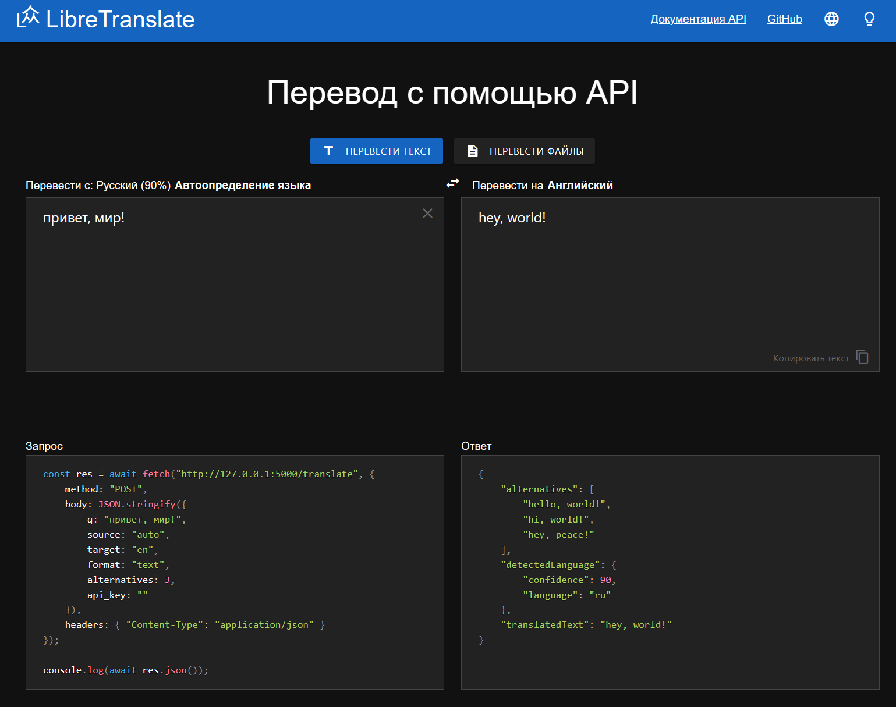
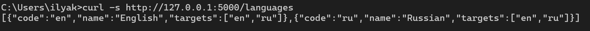
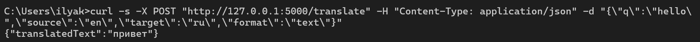
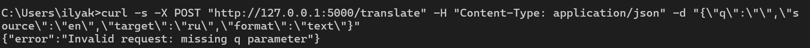
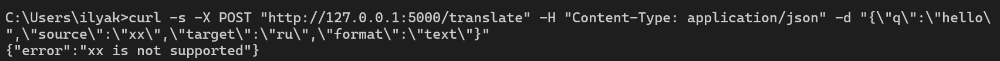
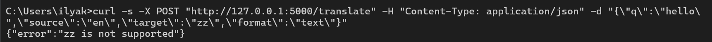

# Тестирование API переводчика LibreTranslate

Проект для учебной работы по дисциплине **«Тестирование программного обеспечения»**.

В работе выполнено:
- развертывание локального экземпляра LibreTranslate;
- ручное тестирование API через командную строку (`curl`);
- автоматизированное тестирование API с помощью Python;
- формирование отчета в формате CSV.

---

## Краткое описание используемых технологий

### LibreTranslate
LibreTranslate - это открытый API для машинного перевода текста между разными языками. Он позволяет отправлять HTTP-запросы на перевод, получать список поддерживаемых языков и использовать автоопределение языка. В данной работе LibreTranslate использовался как объект тестирования.

### requests
`requests` - это популярная Python-библиотека для отправки HTTP-запросов. С её помощью удобно выполнять `GET` и `POST` запросы, получать ответы от сервера и обрабатывать JSON-данные. В данной работе библиотека `requests` использовалась для автоматизированного тестирования API LibreTranslate.

### curl
`curl` - это консольная утилита для отправки HTTP-запросов из командной строки. Она часто применяется для ручной проверки работы веб-сервисов и API. В данной работе `curl` использовался для ручного тестирования API переводчика LibreTranslate.

---

## Содержание проекта

- `translator_api_test.py` — основной Python-скрипт с автотестами
- `requirements.txt` — список зависимостей
- `README.md` — инструкция по установке и запуску

---

## Требования

Для работы необходимо установить:

1. **Python 3.10+**
2. **Git**
3. **curl**  
   На Windows 10/11 обычно уже доступен в `cmd`.
4. Интернет для первоначальной установки Python-пакетов

---

## Установка Python

### Windows

1. Скачать Python с официального сайта:  
   https://www.python.org/downloads/

2. Запустить установщик Python.

3. **Обязательно отметить галочки:**
   - `Add Python to PATH`
   - `Install launcher for all users`

4. Завершить установку.

5. Проверить установку в `cmd`:

```cmd
python --version
py --version
```

---
## Установка Git и клонирование репозитория
### Windows
1. Перейти на официальный сайт Git:
https://git-scm.com/downloads
2. Скачать и установить Git со стандартными настройками.
3. Проверить установку:
git --version

---
## Клонирование репозитория

1.Открыть cmd и выполнить:
 ```cmd
git clone https://github.com/ExIntegra/translator-tests.git
cd translator-tests
```
---

## Создание  и активация виртуального окружения

1. В папке проекта выполнить:
```cmd
py -m venv .venv
.venv\Scripts\activate
```
---

Установка зависимостей

1. После активации виртуального окружения установить зависимости:
```cmd
pip install -r requirements.txt
```
2.Проверить, что зависимости установлены:
```cmd
pip show requests
pip show libretranslate
```
---

## Запуск локального сервера LibreTranslate

1. Перед запуском тестов необходимо поднять локальный сервер LibreTranslate.
В активированном виртуальном окружении выполнить:
```cmd
libretranslate --load-only en,ru
```
2. После запуска сервер будет доступен по адресу:
http://127.0.0.1:5000



---

## Ручная проверка API через curl

Ручную проверку рекомендуется выполнять через обычную командную строку cmd.

Получение списка языков
```cmd
curl -s http://127.0.0.1:5000/languages
```


Перевод текста с английского на русский
```cmd
curl -s -X POST "http://127.0.0.1:5000/translate" -H "Content-Type: application/json" -d "{\"q\":\"hello\",\"source\":\"en\",\"target\":\"ru\",\"format\":\"text\"}"
```


Негативный тест: пустая строка
```cmd
curl -s -X POST "http://127.0.0.1:5000/translate" -H "Content-Type: application/json" -d "{\"q\":\"\",\"source\":\"en\",\"target\":\"ru\",\"format\":\"text\"}"
```


Негативный тест: неверный исходный язык
```cmd
curl -s -X POST "http://127.0.0.1:5000/translate" -H "Content-Type: application/json" -d "{\"q\":\"hello\",\"source\":\"xx\",\"target\":\"ru\",\"format\":\"text\"}"
```


Негативный тест: неверный целевой язык
```cmd
curl -s -X POST "http://127.0.0.1:5000/translate" -H "Content-Type: application/json" -d "{\"q\":\"hello\",\"source\":\"en\",\"target\":\"zz\",\"format\":\"text\"}"
```

---

## Запуск автотестов

1. Во втором терминале, не закрывая сервер LibreTranslate, выполнить:
```cmd
python translator_api_test.py
```
2. После выполнения тестов в каталоге проекта создается файл:
```cmd
report.csv
Пример вывода в консоли
```
Результаты тестов:
```cmd
TC-01: PASSED | Получение списка языков
TC-02: PASSED | Перевод hello en->ru
TC-03: PASSED | Перевод Доброе утро ru->en
TC-04: PASSED | Автоопределение языка en->ru
TC-05: PASSED | Пустая строка
TC-06: PASSED | Неверный source
TC-07: PASSED | Неверный target

Всего: 7
Пройдено: 7
Провалено: 0
Отчет сохранен в: C:\translator-tests\report.csv
Формат результата
```
После запуска тестов формируется файл report.csv, который содержит:

1. идентификатор теста;
2. название теста;
3. статус выполнения;
4. фактический HTTP-статус;
5. ожидаемый HTTP-статус;
6. ответ сервера;
7. комментарий по результату проверки.
---

## Используемые технологии:
1. Python
2. requests
3. LibreTranslate
4. curl
5. CSV
---

## Результаты работы

В результате выполнения проекта было проведено ручное и автоматизированное тестирование API переводчика LibreTranslate. Проверены основные функции сервиса: получение списка языков, перевод текста, автоопределение языка и обработка некорректных входных данных. Все реализованные тесты успешно выполняются, а результаты тестирования сохраняются в отдельный отчет.

---

## Авторы работы
* И.А. Калинин
* Д.С. Борисова
* Ю.А Голубева
